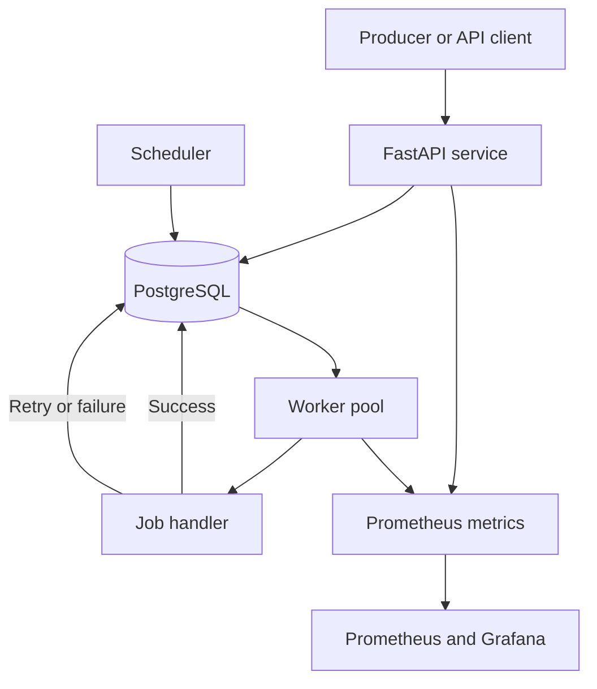

# Distributed Job Queue with PostgreSQL Coordination

A PostgreSQL-backed background job-processing system with a FastAPI service, concurrent workers, delayed retries, recurring schedules, queue metrics, Docker Compose, and Kubernetes deployment manifests.

The project explores how a relational database can coordinate asynchronous workers when an application needs durable jobs without introducing a separate message broker.

## Motivation

Applications often need to move slow or failure-prone work outside the request path. Examples include sending email, generating reports, processing media, and synchronizing data with another service.

I built this project to study the main components of a background job system:

- Safely claiming jobs from multiple workers.
- Recovering work after a worker stops.
- Retrying temporary failures with a delay.
- Separating permanently failed jobs.
- Scheduling recurring work.
- Applying queue priorities and rate limits.
- Monitoring queue depth, execution time, and failures.
- Running the components locally and through Kubernetes manifests.

## Features

- PostgreSQL-backed job storage
- Concurrent worker processes
- Row-level locking for job claims
- Lease-based recovery of interrupted jobs
- Delayed retries with exponential backoff
- Dead-letter state after retry exhaustion
- Idempotency keys for duplicate submissions
- Named queues and job priorities
- Recurring schedules using cron expressions
- Database-backed rate-limit state
- FastAPI endpoints and a local dashboard
- Prometheus metrics and Grafana configuration
- Docker and Docker Compose setup
- Kubernetes manifests for the API, workers, scheduler, and supporting services

## Architecture



PostgreSQL stores job state, schedules, idempotency keys, lock ownership, and retry timing. Workers select available jobs in short transactions, record ownership, and execute handlers outside the claim transaction.

## Job Lifecycle

```text
PENDING -> RUNNING -> COMPLETED
              |
              +----> PENDING after retry delay
              |
              +----> DEAD after retry exhaustion
```

A typical job moves through the following steps:

1. The API inserts a pending job with a queue, priority, and optional idempotency key.
2. A worker atomically claims an available job using a row-level lock.
3. The worker records its identity and claim time.
4. The handler executes outside the claim transaction.
5. A successful job is marked completed.
6. A temporary failure schedules another attempt using a future `run_after` value.
7. A job that exhausts its allowed attempts moves to the dead-letter state.
8. Work owned by an unavailable worker can be reclaimed after its lease expires.

## Delivery Semantics

The queue should be described as providing **at-least-once execution**, not exactly-once execution.

Row-level locking prevents two workers from claiming the same currently available row within the claim transaction. However, duplicate execution can still occur:

1. A worker claims a job.
2. The handler performs an external side effect.
3. The worker stops before recording completion.
4. The lease expires and another worker retries the job.

Handlers that send email, charge a payment method, or modify another service should therefore support idempotency or use a downstream deduplication key.

An enqueue idempotency key prevents duplicate job records for the same submission key. It does not guarantee that the handler’s external side effect happens exactly once.

## Database Schema

The core job record contains scheduling, ownership, retry, and idempotency fields:

```sql
CREATE TABLE jobs (
    id UUID PRIMARY KEY DEFAULT gen_random_uuid(),
    type TEXT NOT NULL,
    payload JSONB NOT NULL DEFAULT '{}'::jsonb,
    status TEXT NOT NULL DEFAULT 'PENDING',
    queue TEXT NOT NULL DEFAULT 'default',
    priority INT NOT NULL DEFAULT 0,
    attempts INT NOT NULL DEFAULT 0,
    max_attempts INT NOT NULL DEFAULT 5,
    run_after TIMESTAMPTZ NOT NULL DEFAULT NOW(),
    locked_by TEXT,
    locked_at TIMESTAMPTZ,
    last_error TEXT,
    idempotency_key TEXT,
    created_at TIMESTAMPTZ NOT NULL DEFAULT NOW(),
    updated_at TIMESTAMPTZ NOT NULL DEFAULT NOW()
);

CREATE INDEX jobs_pick_idx
ON jobs (status, queue, run_after, priority DESC, created_at);
```

If idempotency is required, the database schema should also enforce the intended uniqueness scope with a unique constraint or index. Application-level checks alone are vulnerable to concurrent insert races.

## Technology

| Area | Technology |
| --- | --- |
| Language | Python 3.11 |
| API | FastAPI |
| Database | PostgreSQL 16 |
| Database driver | psycopg 3 |
| Scheduling | croniter |
| Metrics | Prometheus |
| Dashboards | Grafana |
| Local orchestration | Docker Compose |
| Deployment manifests | Kubernetes |

## Local Setup

Clone the repository and enter the application directory:

```bash
git clone https://github.com/dhyanagni2001-commits/Distributed-Job-Queue-with-SQL-backed-Coordination.git
cd Distributed-Job-Queue-with-SQL-backed-Coordination/sql-job-queue
```

Start the application services:

```bash
docker compose up --build -d
```

Inspect container status and logs:

```bash
docker compose ps
docker compose logs -f
```

Stop the services:

```bash
docker compose down
```

Review the Compose file before using `docker compose down -v`, because removing volumes also removes the local PostgreSQL data stored in those volumes.

## API Examples

### Submit a Job

```bash
curl -X POST "http://localhost:8000/jobs" \
  -H "Content-Type: application/json" \
  -d '{
    "type": "demo.sleep",
    "payload": {
      "seconds": 2
    }
  }'
```

### List Jobs

```bash
curl "http://localhost:8000/jobs"
```

### Local Dashboard

```text
http://localhost:8000/
```

The example service is intended for local development. Do not expose it publicly unless authentication, authorization, request validation, rate-limit identity, and transport security have been configured and tested.

## Recurring Schedules

Recurring jobs use cron expressions. Example schedule payload:

```json
{
  "type": "demo.sleep",
  "payload": {
    "seconds": 1
  },
  "cron": "*/5 * * * *"
}
```

The scheduler calculates the next execution time and inserts a job when a schedule becomes due.

If multiple scheduler replicas are allowed to process the same schedule, the implementation needs database locking or a unique occurrence key to prevent duplicate job creation. Kubernetes deployment alone does not provide scheduler leader election.

## Named Queues and Priorities

Jobs can specify a queue name such as `default`, `email`, or `video`. Workers can be assigned to specific queues.

Within a queue, available jobs can be selected by priority and creation time. With multiple workers, exact global start or completion order is not guaranteed.

A continuous stream of high-priority jobs may delay lower-priority work unless the implementation applies and tests an aging or fairness policy.

## Cancellation and Manual Retry

The API can update queued job state for cancellation or retry operations.

Cancellation is straightforward before a worker starts the job. Once a handler is running, changing the database state does not automatically stop code that is already executing. Running-job cancellation requires cooperative checks, process termination, or handler-specific cancellation behavior.

Manual retry should preserve an audit history and avoid resetting fields in a way that hides previous failures.

## Rate Limiting

The project includes token-bucket-style rate-limit state stored in PostgreSQL.

A database-backed limiter can coordinate limits across API replicas, but it adds database writes and contention to the request path. The client identity, transaction boundaries, clock behavior, and cleanup of old limiter state should be tested before treating it as an abuse-prevention control.

## Metrics and Dashboards

Start the application with the observability configuration:

```bash
docker compose \
  -f docker-compose.yml \
  -f docker-compose.observability.yml \
  up -d
```

Local services:

| Service | Address |
| --- | --- |
| Prometheus | `http://localhost:9090` |
| Grafana | `http://localhost:3000` |

The local Grafana configuration uses `admin` as both the username and password. Change these credentials before using the configuration outside a local environment.

Available metrics include:

- `jobs_enqueued_total`
- `jobs_completed_total`
- `worker_jobs_completed_total`
- `worker_job_duration_seconds`
- `jobs_pending`

Metric names describe the current implementation. Alert thresholds and dashboard panels should be validated against a representative workload.

## Kubernetes Manifests

Check the currently selected Kubernetes context before applying the manifests:

```bash
kubectl config current-context
kubectl apply -f k8s/
```

The manifests describe components such as:

- PostgreSQL StatefulSet
- API Deployment
- Worker Deployment
- Scheduler Deployment
- ConfigMaps and Secrets
- Horizontal Pod Autoscaler configuration

These files demonstrate how the services can be represented as Kubernetes resources. They are not, by themselves, evidence that the system is highly available, secure, or ready for production traffic.

Important deployment considerations include:

- A single PostgreSQL StatefulSet is not a highly available database design.
- Kubernetes Secrets are base64-encoded and require appropriate access controls and encryption configuration.
- CPU-based worker scaling does not necessarily reflect queue backlog.
- Queue-depth scaling requires a working metrics adapter and custom-metric configuration.
- Worker shutdown should stop new claims and allow current jobs to finish or lose their leases safely.
- Schema migrations need a controlled deployment process.

## Design Tradeoffs

### PostgreSQL Instead of a Dedicated Broker

PostgreSQL provides durable storage, transactions, indexes, and row-level locking. It can simplify deployment when an application already depends on PostgreSQL and has a moderate background workload.

The tradeoff is that job polling and state changes compete with application queries for connections, I/O, locks, and table maintenance.

### Polling

Polling is straightforward and works without a separate notification service. Short intervals reduce pickup latency but increase empty database queries. Long intervals reduce database load but delay new jobs.

### Leases

Leases allow another worker to recover unfinished jobs. A short lease improves recovery speed but increases duplicate-execution risk during pauses or slow handlers. A long lease reduces premature reclaiming but delays recovery after a genuine crash.

### Exponential Backoff

Backoff reduces repeated pressure on a failing dependency. It also delays recovery and needs a maximum delay and jitter to avoid synchronized retry spikes.

### Database Rate Limiting

Storing rate-limit state in PostgreSQL provides coordination across API replicas but increases database work. A high-traffic service may use a dedicated in-memory store or gateway-level limiter instead.

### Kubernetes

Kubernetes provides declarative deployment and replica management, but it adds operational complexity. It does not automatically solve database availability, queue semantics, safe shutdown, observability, or capacity planning.

## Limitations

- At-least-once execution can produce duplicate handler side effects.
- Strict ordering is not guaranteed with concurrent workers.
- Priority fairness requires sustained-load testing.
- Scheduler deduplication must be verified with multiple replicas.
- Running-job cancellation requires cooperative handler support.
- Database-backed polling and rate limiting can create contention.
- The Kubernetes configuration does not establish database high availability.
- Queue-depth autoscaling depends on external metrics infrastructure.
- No reproducible throughput or latency benchmark is documented in the current README.
- Automated crash-boundary and concurrency test results are not documented.
- The example API configuration should not be exposed publicly without additional security controls.

## Recommended Tests

- Multiple workers attempting to claim the same job
- Worker crash immediately after claiming
- Worker crash after an external side effect but before completion acknowledgement
- Lease expiration while the original worker continues running
- Concurrent submissions using the same idempotency key
- Retry backoff and dead-letter transitions
- Duplicate cron scheduling with two scheduler replicas
- Priority starvation under continuous high-priority traffic
- Graceful worker shutdown during job execution
- Database connection loss during claims and state updates
- Rate-limiter correctness across multiple API replicas

## What I Learned

This project helped me understand how SQL row locking, leases, retry timing, idempotency keys, scheduler coordination, metrics, and container orchestration interact in a distributed job-processing system.

It also demonstrated why infrastructure features must be described precisely: row locking is not the same as exactly-once execution, deployment manifests do not prove production readiness, and autoscaling does not correct unsafe job semantics.
